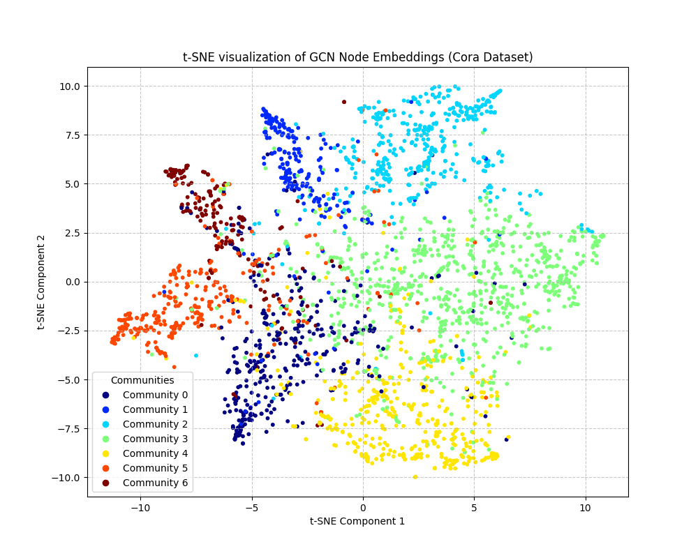

Project Graphy.io:
Social Network Analysis with Graph Neural Networks – Use graph machine
learning (GraphSAGE or GCN) on social network data to detect communities, recommend links, or 1
identify influencers. For example, analyze Twitter follower/following graphs using PyTorch Geometric. 
This project applies advanced graph AI to a real-world network, illustrating complex relational data analysis beyond standard ML.

## LEGEND / KEY TOOLS:

- GNN: Graph Neural Network (GCN/GraphSAGE)
- PyG: PyTorch Geometric
- NX: NetworkX
- Metrics: Accuracy, F1, AUC, NMI, MSE, etc.
- Git: Version Control

## Results
The GCN model achieved approximately 80.2% test accuracy on the Cora dataset.
Here's a t-SNE visualization of the learned node embeddings:

