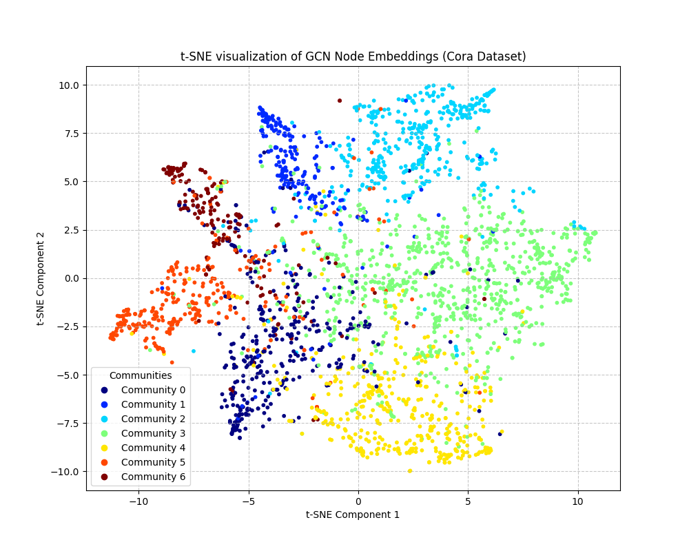

**Graphy.io:**** Social Network Analysis with Graph Neural Networks**
A project dedicated to exploring social network dynamics using advanced Graph Neural Networks (GNNs). Graphy.io leverages graph machine learning models like GCN and GraphSAGE to uncover hidden patterns, detect communities, predict connections, and identify key influencers within complex relational datasets.

**📖 Abstract :**
In the interconnected world of social media, understanding the structure and dynamics of networks is crucial. Traditional machine learning models often fall short when dealing with graph-structured data. This project demonstrates the power of Graph Neural Networks (GNNs) to perform sophisticated analysis on social graphs, such as Twitter's follower/following network. By representing users as nodes and relationships as edges, we can apply models like Graph Convolutional Networks (GCN) and GraphSAGE to tackle complex tasks that are intractable for standard ML techniques. This work serves as a practical illustration of applying advanced graph AI to real-world relational data.

**✨ Key Features**
Community Detection: Identify densely connected clusters of users or communities within the network.

Link Prediction: Recommend new connections or friendships between users who are likely to interact.

Influencer Identification: Pinpoint the most central and influential nodes in the graph based on network topology and features.

Node Classification: Categorize nodes (e.g., users, papers) based on their connections and attributes.

High-Dimensional Visualization: Visualize learned node embeddings using techniques like t-SNE to intuitively understand graph structure.

**🛠️ Tech Stack & Key Tools**
--Python
--PyTorch
--PyTorch Geometric (PyG)
--NetworkX (NX)
--scikit-learn
--NumPy & Pandas
--Matplotlib & Seaborn
--Git & GitHub

**Legend / Key Models**
--GNN: Graph Neural Network
--GCN: Graph Convolutional Network
--GraphSAGE: Graph Sample and Aggregate
--Metrics: Accuracy, F1-Score, AUC, Normalized Mutual Information (NMI), Mean Squared Error (MSE)

**🚀 Project Goals**
Implement GNN Models: Build and train GCN and GraphSAGE models for node classification and link prediction tasks.
Analyze Real-World Data: Apply these models to standard citation networks (like Cora) and potentially larger social network datasets.
Evaluate Performance: Rigorously evaluate the models using a standard set of performance metrics.
Visualize Insights: Generate meaningful visualizations that make the model's learnings and the network structure interpretable.

**⚙️ Installation & Setup**
To get a local copy up and running, follow these simple steps.

**Prerequisites:**
Python 3.8+
pip & venv

**Installation:**

Clone the repository:
git clone https://github.com/kaun-neel/graphy.io.git
cd graphy.io

Create and activate a virtual environment:
python -m venv venv
source venv/bin/activate  # On Windows use `venv\Scripts\activate`

Install the required packages:

First, install PyTorch based on your system/CUDA version. Visit the official PyTorch website for the correct command.

Then, install PyTorch Geometric and other dependencies:

pip install torch_geometric
pip install -r requirements.txt

(Note: requirements.txt should contain numpy, pandas, networkx, scikit-learn, matplotlib, seaborn)

**📈 Results & Evaluation**
Our implementation of a Graph Convolutional Network (GCN) on the Cora dataset demonstrates the effectiveness of GNNs for node classification. The Cora dataset consists of scientific publications linked by citations. The task is to predict the topic category for each paper.

Test Accuracy: The GCN model achieved ~80.2% accuracy on the test set.

Here's a t-SNE visualization of the learned node embeddings:

t-SNE Visualization of Node Embeddings
The following t-SNE plot visualizes the 7-dimensional node embeddings learned by the GCN model, reduced to 2 dimensions. Each color represents a different paper category. The clear clustering indicates that the model has successfully learned to group papers with similar topics together in the embedding space.

**💡 Future Work**
Experiment with GraphSAGE: Implement and compare the performance of GraphSAGE for inductive learning scenarios.

Scale to Larger Graphs: Apply the models to larger, more complex social network datasets like a subset of Twitter or Reddit.

Hyperparameter Tuning: Use techniques like Optuna or Ray Tune to find the optimal hyperparameters for the GNN models.

Deploy as a Web Service: Create a simple API using FastAPI or Flask to serve predictions (e.g., recommend a connection for a given user).

**🤝 Contributing**
Contributions are what make the open-source community such an amazing place to learn, inspire, and create. Any contributions you make are greatly appreciated.

Fork the Project

Create your Feature Branch (git checkout -b feature/AmazingFeature)

Commit your Changes (git commit -m 'Add some AmazingFeature')

Push to the Branch (git push origin feature/AmazingFeature)

Open a Pull Request

**📄 License**
Distributed under the MIT License. See LICENSE for more information.

**📧 Contact**
Indraneel Bose – @kaun-neel – indraneelbose89191@gmail.com

Project Link: https://github.com/kaun-neel/graphy.io
